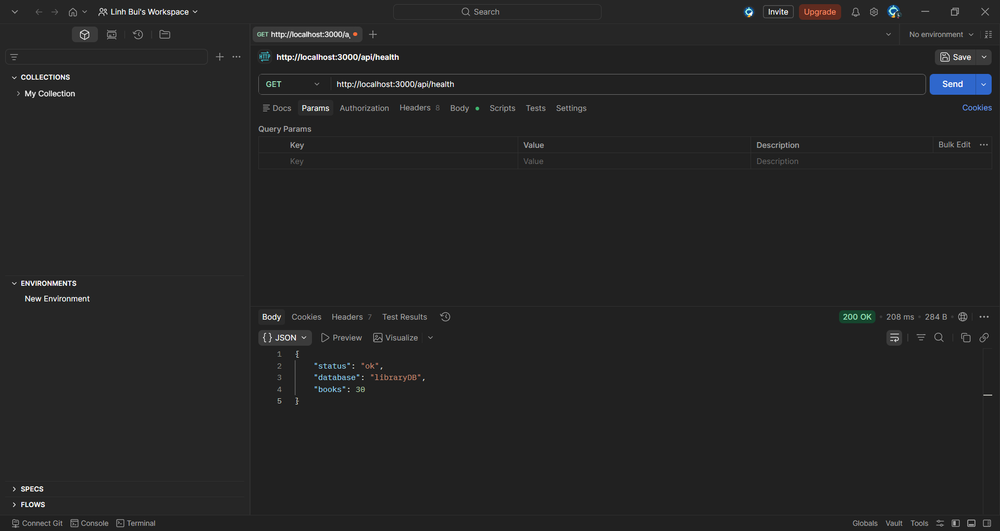
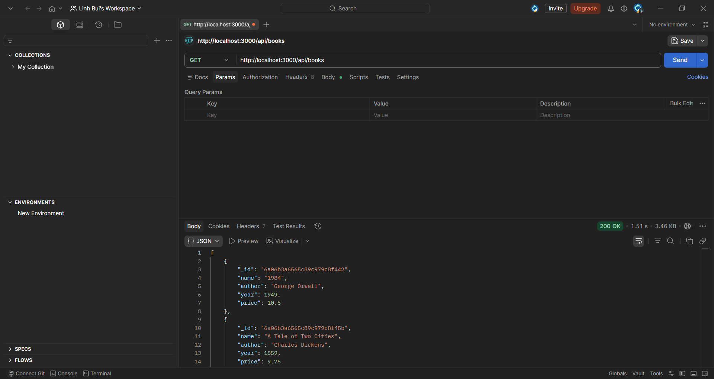
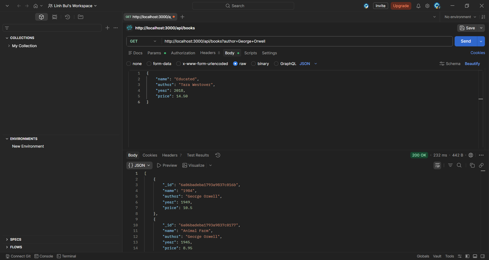
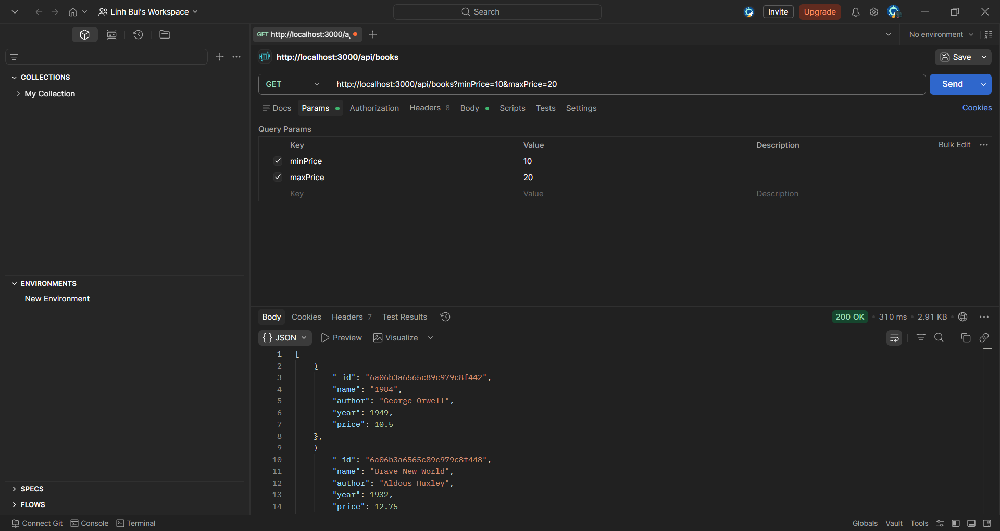
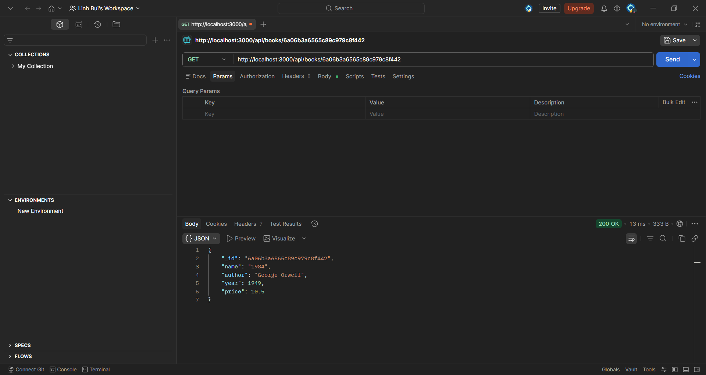
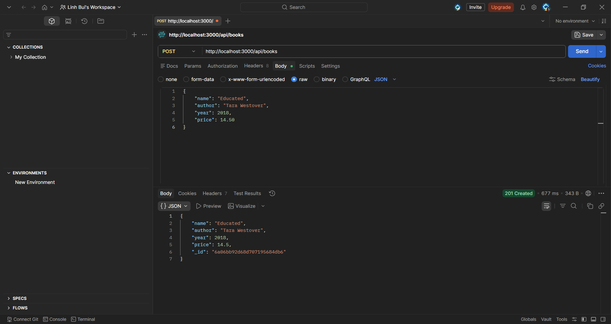
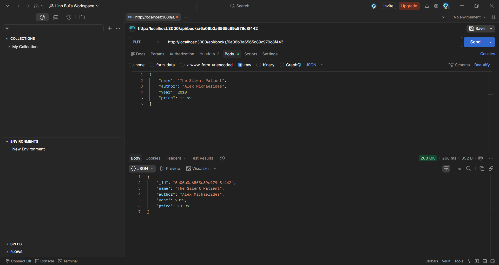
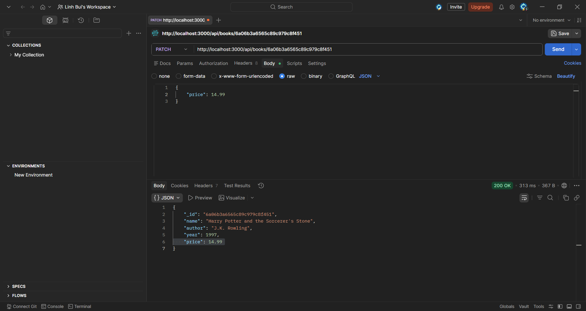
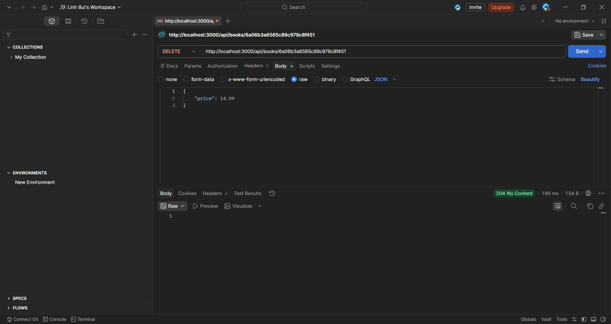

# mongodb-app-02
## Answers
1. What is the purpose of using `.env`

`.env` is used to store environment variables to keep sensitive and configuration data separate from code.

2. How does this work:
```js
if (query.minPrice || query.maxPrice) {
    filter.price = {};
    if (query.minPrice) filter.price.$gte = Number(query.minPrice);
    if (query.maxPrice) filter.price.$lte = Number(query.maxPrice);
}
```

This code creates a MongoDB price filter dynamically using $gte (min price) and $lte (max price) based on what the user provides in the query.

3. What is the program `seed.js` used for?

The program seed.js is used to populate the database with initial data.

4. Try all API routes using Postman

N/A

5. In terms of code what is the difference between `put` and `patch`

`put` replaces entire resource while `patch` only updates specific fields.

## API Routes

| Method | Route | Description |
|---|---|---|
| GET | `/api/health` | Check API and database connection |
| GET | `/api/books` | List all books |
| GET | `/api/books?author=George+Orwell` | Filter by author |
| GET | `/api/books?minPrice=10&maxPrice=20` | Filter by price range |
| GET | `/api/books/:id` | Get one book |
| POST | `/api/books` | Create a book |
| PUT | `/api/books/:id` | Replace a book |
| PATCH | `/api/books/:id` | Partially update a book |
| DELETE | `/api/books/:id` | Delete a book |

## Screenshots
         